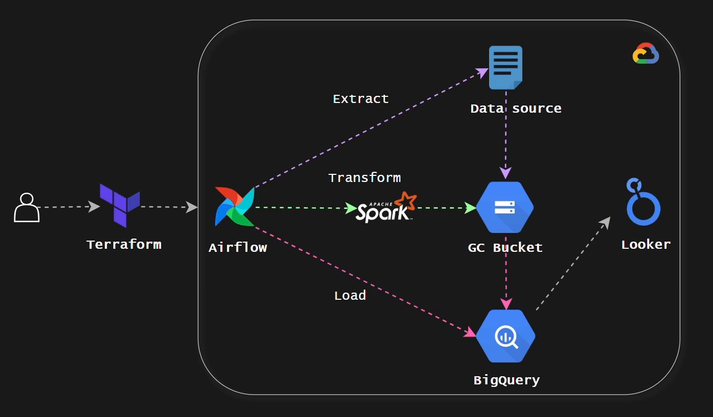
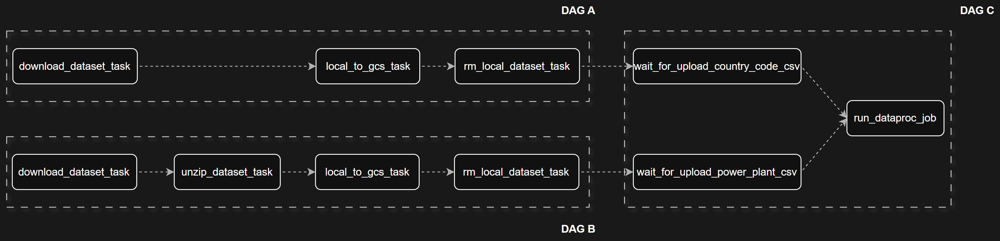
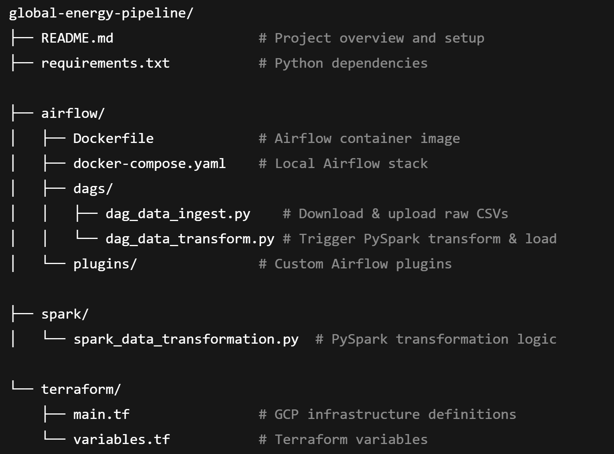
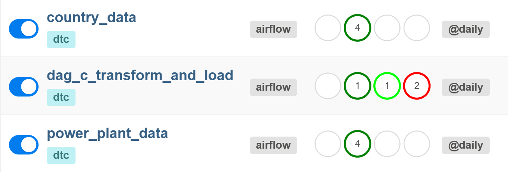

# Global Energy Capacity Dashboard

### Project Overview

This repository contains a complete data engineering solution for analyzing global energy production capacity. It features a comprehensive pipeline deployed on Google Cloud Platform (GCP), with data ingestion, processing, and visualization. The end result is an interactive dashboard built in Looker, providing insights into the global distribution of energy resources.

---

### Problem Statement

Geographical and Renewable Energy Analysis

This project seeks to answer key questions about global energy infrastructure:

#### Geographical Analysis:

- How is electrical capacity (measured in megawatts, MW) distributed across countries and regions worldwide?

#### Renewable vs. Non-Renewable Energy:

- How do renewable and non-renewable energy capacities compare across countries?

#### Energy Type Breakdown:

- Within each country, what proportion of installed electrical capacity comes from different energy types (e.g., coal, solar, wind)?

----

### Solution Architecture



#### Design Flow: 

Terraform → Google Cloud → Airflow (or Cloud Composer) → Spark (Dataproc) → BigQuery → Looker

#### Summary:
The pipeline is built on Google Cloud Platform with Terraform for infrastructure automation and Airflow for workflow orchestration:

1. **Terraform** provisions all cloud infrastructure.

2. **Airflow** orchestrates ETL tasks:

   

   - Extract: Pull raw data from public sources, ingesting CSV files into Google Cloud Storage (GCS).

   - Transform & Load: Data processing using Apache Spark, joining tables, categorizing energy types and aggregating installed capacity.

        NOTE: We will use Google Dataproc to submit Spark job ([Link](https://cloud.google.com/dataproc?hl=en))

3. **BigQuery** stores processed data ready for analytics.

4. **Looker Studio** visualizes the data, providing interactive and insightful dashboards.

----
### Dashboard & Visualization

#### Interactive Looker Dashboard


[Link to Dashboard](https://lookerstudio.google.com/reporting/40f55f2f-8445-44e4-a7a3-e2c2471da88f)

The Looker dashboard features:

1.  ##### World Map Visualization:

    - Displays total installed electrical capacity (MW) by country.

    - Interactive: Clicking a country zooms into detailed country-level insights.
   
2. ##### Country-level Pie Chart:

   - Illustrates the percentage breakdown of installed capacity segmented by energy category (%):

     - Renewable

     - Non-renewable

     - Other

3. ##### Country-level Bar Chart:

   - Shows total installed electrical capacity (MW) by specific energy types (coal, gas, nuclear, solar, wind, biomass, etc.)

This dashboard helps you quickly visualize and understand energy production trends and distributions at both global and local levels.

---
### Repository Structure



---

### Getting Started

#### Prerequisites

1. Google Cloud Platform account with billing **enabled**
3. Download service account in json format with the following roles. ```NOTE:``` Refine your IAM roles if neccessary. These are just examples for a POC:

   - Storage Admin (for GCS buckets)

   - Dataproc Admin (for creating and managing Dataproc clusters)

   - BigQuery Data Editor (for writing to BigQuery tables)

   - Composer Admin (if using Cloud Composer for Airflow)


3. Terraform

4. Apache Airflow (Local or Cloud Composer)

5. Spark (Dataproc)

#### Deployment and Configuration Steps

1. #### Provision Google Cloud Infrastructure:
   - Ensure Terraform is installed (see [Terraform Installation guide](https://github.com/DataTalksClub/data-engineering-zoomcamp/tree/main/01-docker-terraform/1_terraform_gcp))
   - The configuration in /terraform/main.tf provisions the following resources:
     - Google Cloud Storage
     - Google Cloud BigQuery
     - Google Cloud Dataproc
     - Google Cloud Composer (Optional)
   - Update the service account file path and other variables in ```terraform/variables.tf```:

      ```
      variable "credentials" {
      description = "My Credentials"
      default     = "path_to_your_credentials/google_credentials.json"
      }
      ```
   - Initialize and apply the Terraform configuration:

      ```
      terraform init
      terraform plan
      terraform apply
      ```

2. Deploy Airflow DAGs:
   
   You may deploy Airflow locally (via Docker) or use Cloud Composer (Optional).
   - **Local Deployment:**
      - Install Airflow (see [Airflow installation guide](https://github.com/DataTalksClub/data-engineering-zoomcamp/blob/main/cohorts/2022/week_2_data_ingestion/airflow/1_setup_official.md))
      
      - In ```/airflow/docker-compose.yaml```, configure the service account file path:
  
         ```
         GOOGLE_APPLICATION_CREDENTIALS: path_to_your_credentials/google_credentials.json
         ```
      - Update ```airflow/.env``` with project-specific variables:

         ```
         GCP_PROJECT_ID       = #Update your projectID
         GCP_GCS_BUCKET       = #Update your bucket
         BIGQUERY_DATASET     = #Update your dataset 
         DATAPROC_NAME        = #Update dataproc cluster
         DATAPROC_TEMP_BUCKET = #Update dataproc-temporary bucket
         ```
      - Build and initialize the Docker image (only required for first time build or when dependencies change):
         
         Build the image
         ```
         docker-compose build
         ```

         Initialize Airflow
         ```
         docker-compose up airflow-init
         ```

         Spin up the services from container
         ```
         docker-compose up
         ```

         Make sure the Airflow container is up and running 
         ```
         docker ps
         ```
         
      - Access the UI at ```http://localhost:8080``` (default credentials: ```airflow / airflow```).
 
         
      NOTE: **Do not** trigger them yet. We will do this later in step 4

   - **Cloud Composer(Optional):**
      - Uncomment the Cloud Composer resource in ```terraform/main.tf``` and reapply terraform

         ```
         terraform plan
         terraform apply
         ```
      - Update environment variables in Cloud Composer:
         ```
         GCP_GCS_BUCKET       = # Update your bucket
         BIGQUERY_DATASET     = # Update your dataset 
         DATAPROC_NAME        = # Update dataproc cluster
         DATAPROC_TEMP_BUCKET = # Update dataproc-temporary bucket
         ```
      -  Upload your DAG files in ```airflow/dags/``` to the Composer-managed bucket:
         ```
         gsutil cp -r dag_data_ingest.py dag_data_transformation.py gs://your-cloud-composer-created-bucket/dags/
         ```
      - Open the Composer Airflow UI in the GCP Console: 
      
         NOTE: **Do not** trigger them yet. We will do this later in step 4
  
3. Configuring the Spark transformation:
   - Dataproc creates a temporary bucket udring creation. Locate that bucket. Make sure you have updated ```DATAPROC_TEMP_BUCKET``` in ```airflow/.env```:
  
         DATAPROC_TEMP_BUCKET    = # Update dataproc-temporary bucket

   - Upload your transformation script to the bucket you created in Step 1:
      ```
      gsutil cp -r spark_data_transformation.py gs://your-created-bucket/code/spark_data_transformation.py
      ```
4. Partioning and Clustering Bigquery dataset:
   - In ```spark/spark_data_transformation.py```, choose which dimensions to partitioning and clustering. By default, the script partitioning ```run_date``` and clustering ```energy_type, energy_category```. 
   
   - Explain:
         
      - Partionining ```run_date``` easily compares “today vs. yesterday” or build time‑series analyses. And also boost performance (e.g. WHERE ```run_date = '2025-04-13'```) and save scanning costs.
      - Clustering ```energy_type```, ```energy_category``` - the most-queried dimensions in the dataset. Fast aggregations with low latency and scanning costs. 
   - Configure your dimensions if needed:
      ```
      # Write
      (df_global_elec_capacity
      .write
      .format("bigquery")
      .option("table", f"{args.dataset}.global_energy_report_2024")
      .option("partitionField", "your-dimension")
      .option("clusteringFields", "your-dimension,
      your-dimension")
      .save()
      ) 
      ```

#### Execute the Pipeline

Trigger your Airflow DAGs to ingest data into GCS, submit Spark jobs on Dataproc, and load results into BigQuery. Once complete, locate ```global_energy_report_2024``` in BigQuery. Connect Looker to your the BigQuery dataset and import the dashboard definitions.

#### Destroy cloud resources

Make sure you destroy all cloud resources when the Pipeline is completed.

   ```
   terraform destroy
   ```

---
### Impact and Applications

This project empowers you to:

- Understand global energy capacity distribution

- Identify leaders in renewable energy investments

- Make informed strategic energy infrastructure decisions

### Let’s Connect!
I hope you find this project insightful and valuable. If you’d like to discuss the architecture, share feedback, or just say hello, feel free to connect with me on LinkedIn: [Linh Mai](https://www.linkedin.com/in/linhhaimai/)


Looking forward to collaborating and exchanging ideas!

